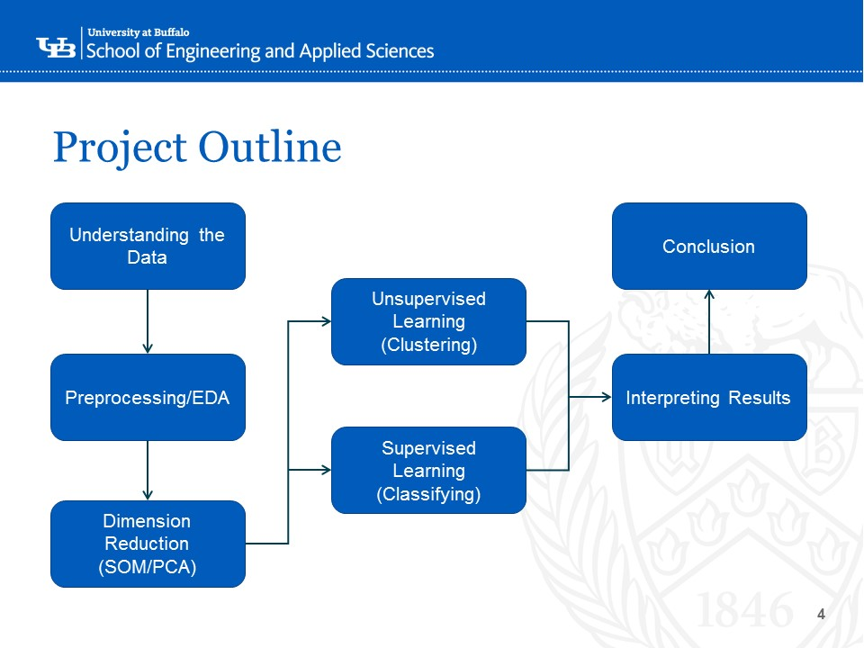
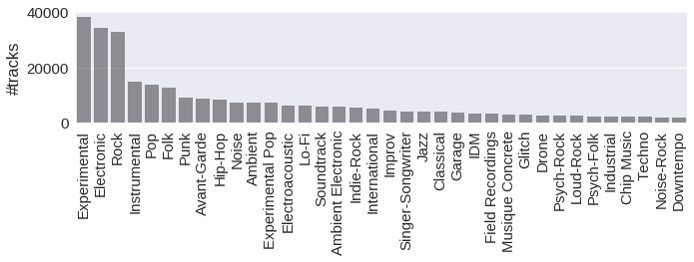

# Music-Metadata-Clustering-in-R
A project and slideshow focused on using statistical metadata to cluster music tracks into genres.  A general project work flow is shown below.

## Scope of Data
The data was acquired from [FMA: A Dataset For Music Analysis](https://github.com/mdeff/fma). Description pulled from the FMA git page:
>We introduce the Free Music Archive (FMA), an open and easily accessible dataset suitable for evaluating several tasks in MIR, a field concerned with browsing, searching, and organizing large music collections. The community's growing interest in feature and end-to-end learning is however restrained by the limited availability of large audio datasets. The FMA aims to overcome this hurdle by providing 917 GiB and 343 days of Creative Commons-licensed audio from 106,574 tracks from 16,341 artists and 14,854 albums, arranged in a hierarchical taxonomy of 161 genres. It provides full-length and high-quality audio, pre-computed features, together with track- and user-level metadata, tags, and free-form text such as biographies. We here describe the dataset and how it was created, propose a train/validation/test split and three subsets, discuss some suitable MIR tasks, and evaluate some baselines for genre recognition.

To summarize:
* 917 GB
* 343 days of audio
* 106,547 tracks
* 161 genres

The tracks aren't evenly distributed among genres. Shown below is a breakdown of the relative genre frequencies for the entire dataset.

Each track contains data of measurable musical descriptors:
* Chroma
* MFCC
* Spectral Bandwidth
* Spectral Centroid
* Spectral Contrast
* Spectral Rolloff
* Tonnetz
* ZCR

## Project Motivation
As music recommender software becomes more popular, so to does the demand for better recommender algorithms to cluster music that a user may enjoy. This project was motivated by an interest in understanding how music metadata can be used to cluster similar tracks together.
### Existing Recommender Methods
* Manual Curation
* Manual Attribute Tagging
* Collaborative Filtering
* Natural Language Processing
* *Raw Audio Modeling(this project)*
